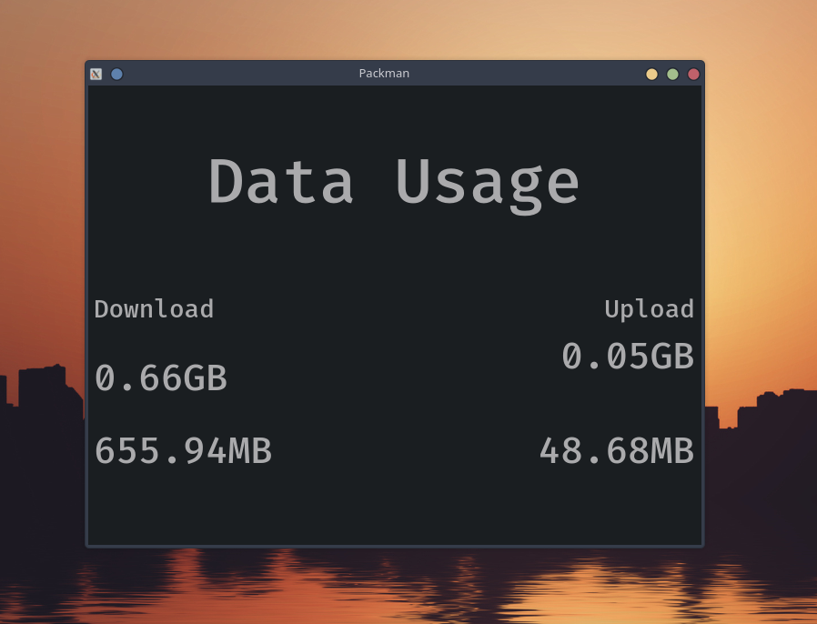
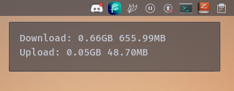

# CPackman

C++ Port of https://github.com/skynse/packman

Works only on linux for now due to getifaddrs being the only method for network interface information grabbing.

By default, ipnetlib is set to grab information from network interfaces called "wlan0" only. Before compiling cpackman, change that to the name of your interface in src/ipnetlib.cpp

The backlog feature has been removed due to inconvenience

